# Yuri Moinhos

[](mailto:moinhosyuri@gmail.com)
[](https://www.linkedin.com/in/yurimoinhos/)
[](https://github.com/yurimoinhos)

Desenvolvedor full-stack com foco em **sistemas distribuídos**, **APIs de alto desempenho** e **produtos web**. Atuo do domínio ao deploy: backends em Java/Kotlin, .NET e Go; frontends em React e Angular; dados relacionais, documentais e em grafo; mensageria e segurança como parte do desenho — não como afterthought.

```text
Backend  ·  Frontend  ·  Dados  ·  Mensageria  ·  Segurança  ·  Cloud
```

---

## Mapa de competências

> Cada folha descreve **como** a tecnologia é usada — não detalhes de projeto.

```mermaid
%%{init: {
  "theme": "base",
  "themeVariables": {
    "fontFamily": "Inter, Segoe UI, system-ui, sans-serif",
    "fontSize": "14px",
    "primaryColor": "#1f6feb",
    "primaryTextColor": "#f0f6fc",
    "primaryBorderColor": "#388bfd",
    "secondaryColor": "#238636",
    "secondaryTextColor": "#f0f6fc",
    "secondaryBorderColor": "#3fb950",
    "tertiaryColor": "#8957e5",
    "tertiaryTextColor": "#f0f6fc",
    "tertiaryBorderColor": "#a371f7",
    "lineColor": "#6e7681",
    "textColor": "#e6edf3",
    "mainBkg": "#161b22",
    "nodeBorder": "#30363d",
    "clusterBkg": "#0d1117",
    "clusterBorder": "#30363d",
    "titleColor": "#e6edf3",
    "edgeLabelBackground": "#0d1117"
  },
  "flowchart": {
    "curve": "basis",
    "padding": 16,
    "nodeSpacing": 28,
    "rankSpacing": 48,
    "htmlLabels": true
  }
}}%%
flowchart TB
  ROOT(["✦  Competências"])

  ROOT --> BE
  ROOT --> FE
  ROOT --> DATA
  ROOT --> PLAT

  subgraph BE["⚙️  Backend"]
    direction TB
    JK["☕  Java / Kotlin"]
    NET["🟣  .NET"]
    GO["🔵  Golang"]

    JK --> JK1["Spring Boot<br/><i>APIs REST · domínio rico</i>"]
    JK --> JK2["Quarkus<br/><i>cloud-native · startup rápido</i>"]

    NET --> NET1["ASP.NET Core<br/><i>APIs enterprise · middleware</i>"]
    NET --> NET2[".NET Aspire<br/><i>orquestração local · observabilidade</i>"]

    GO --> GO1["gRPC / HTTP<br/><i>baixa latência · contratos tipados</i>"]
    GO --> GO2["Microsserviços<br/><i>gateways · workers leves</i>"]
  end

  subgraph FE["🖥️  Frontend"]
    direction TB
    RE["⚛️  React"]
    NG["🅰️  Angular"]

    RE --> RE1["Next.js<br/><i>SSR / SSG · rotas e SEO</i>"]
    RE --> RE2["TanStack Query<br/><i>cache · estado de servidor</i>"]

    NG --> NG1["Signals<br/><i>estado reativo fino · fine-grained</i>"]
    NG --> NG2["Standalone Components<br/><i>árvore sem NgModule</i>"]
  end

  subgraph DATA["🗄️  Dados"]
    direction TB
    SQL["📐  SQL"]
    DOC["📄  Documentos"]
    GRAF["🕸️  Grafos"]

    SQL --> SQL1["PostgreSQL / MySQL / SQL Server<br/><i>transações · modelagem · reporting</i>"]
    DOC --> DOC1["MongoDB<br/><i>schema flexível · agregados</i>"]
    DOC --> DOC2["Redis<br/><i>cache · sessões · estruturas</i>"]
    GRAF --> GRAF1["Neo4j<br/><i>relacionamentos · recomendações</i>"]
  end

  subgraph PLAT["🛡️  Plataforma"]
    direction TB
    MSG["📨  Mensageria"]
    SEC["🔐  Segurança"]
    OPS["🚀  DevOps"]

    MSG --> MSG1["Kafka<br/><i>streams · alto volume · replay</i>"]
    MSG --> MSG2["RabbitMQ / Service Bus<br/><i>filas · routing · integração</i>"]

    SEC --> SEC1["OAuth2 / OIDC + JWT<br/><i>identidade · tokens · escopos</i>"]
    SEC --> SEC2["Zero Trust · RBAC<br/><i>least privilege · auditoria</i>"]

    OPS --> OPS1["Docker · CI/CD<br/><i>build · pipelines · releases</i>"]
    OPS --> OPS2["Azure Container Apps<br/><i>deploy managed · scale</i>"]
  end

  classDef root fill:#1f6feb,stroke:#58a6ff,stroke-width:2px,color:#fff,font-weight:700
  classDef pillar fill:#21262d,stroke:#8b949e,stroke-width:1px,color:#e6edf3,font-weight:600
  classDef leaf fill:#161b22,stroke:#30363d,stroke-width:1px,color:#c9d1d9
  classDef be fill:#1a2332,stroke:#388bfd,color:#79c0ff
  classDef fe fill:#2a1f24,stroke:#f778ba,color:#ff7b72
  classDef data fill:#1a2a22,stroke:#3fb950,color:#56d364
  classDef plat fill:#241f2e,stroke:#a371f7,color:#d2a8ff

  class ROOT root
  class JK,NET,GO be
  class RE,NG fe
  class SQL,DOC,GRAF data
  class MSG,SEC,OPS plat
  class JK1,JK2,NET1,NET2,GO1,GO2,RE1,RE2,NG1,NG2,SQL1,DOC1,DOC2,GRAF1,MSG1,MSG2,SEC1,SEC2,OPS1,OPS2 leaf
```



---

## Stack por camada

### Linguagens & runtimes

| Stack | Uso típico | Nível |
|------:|:-----------|:-----:|
| **Java / Kotlin** | Domínio rico, APIs, ORMs, microsserviços (Spring / Quarkus) | ████████░░ |
| **.NET** | APIs, Aspire, integrações enterprise | ███████░░░ |
| **Golang** | Gateways, gRPC, serviços de baixa latência | ███████░░░ |
| **TypeScript** | Frontends, contratos, tooling | ████████░░ |
| **SQL** | Modelagem, queries, performance | ████████░░ |

<p align="center">
  
  
  
  
  
</p>

### Backend

<p align="center">
  
  
  
  
  
</p>

### Frontend

<p align="center">
  
  
  
  
</p>

### Bancos de dados

| Paradigma | Tecnologias | Quando uso |
|-----------|-------------|------------|
| **SQL / Relacional** | PostgreSQL, MySQL, SQL Server | Consistência, transações, reporting |
| **Documentos** | MongoDB, Redis (cache/estrutura) | Schema flexível, sessões, agregados |
| **Grafos** | Neo4j | Relacionamentos densos, recomendações |

<p align="center">
  
  
  
  
  
  
</p>

---

## Mensageria & eventos

| Padrão | Ferramenta | Objetivo |
|--------|------------|----------|
| Event streaming | **Apache Kafka** | Alto volume, replay, pipelines |
| Filas de trabalho | **RabbitMQ** | Orquestração, routing, retries |
| Cloud messaging | **Azure Service Bus** | Integração managed na nuvem |
| Confiabilidade | Outbox, idempotência, DLQ | Entrega at-least-once sem duplicar efeito |

<p align="center">
  
  
  
</p>

---

## Segurança (by design)

| Prática | Detalhe |
|---------|---------|
| **Autenticação** | OAuth 2.0 / OpenID Connect, JWT com validação de assinatura e expiração |
| **Autorização** | RBAC e escopos por recurso — least privilege |
| **Transporte** | TLS end-to-end, sem credenciais em plain text |
| **Segredos** | Vault / variáveis gerenciadas — nunca no código |
| **APIs** | OpenAPI versionado, rate limiting, input validation |
| **Operação** | Observabilidade, auditoria e princípio de zero trust entre serviços |

<p align="center">
  
  
  
  
</p>

---

## Formação

- **Ciência de Dados e Inteligência Artificial** — SENAI CIMATEC

---

## GitHub

<div align="center">
  
  
</div>

<div align="center">
  
</div>

<div align="center">
  
</div>

---

## Contato

Aberto a conversas sobre arquitetura, produtos e oportunidades.

[](mailto:moinhosyuri@gmail.com)
[](https://www.linkedin.com/in/yurimoinhos/)

---

⭐️ [github.com/yurimoinhos](https://github.com/yurimoinhos)
